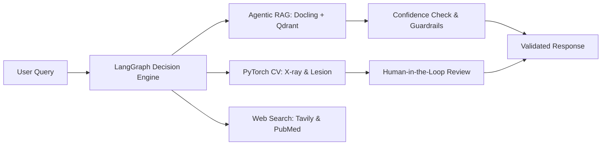

# Hi 👋, I'm Charan

**Software Engineer** specializing in **Scalable Backend Systems**, **Applied AI / Machine Learning**, and **Full-Stack Engineering**.

---

## 👨🏻‍💻 About Me

I'm a **Software Engineer** at [Skizen](https://skizen.in/) with previous experience at [Lumiq](https://lumiq.ai/), holding a B.Tech in Computer Science and Design from [IIIT Delhi](https://iiitd.ac.in) (2020–2024).

I build production-oriented systems where robust software engineering meets applied AI:
- **Backend Architecture & APIs:** Developing scalable RESTful services, spatial query engines, and real-time communication systems with Django REST Framework, FastAPI, Node.js/Express, and PostgreSQL.
- **Asynchronous & Data Pipelines:** Designing distributed background task pipelines with Celery and Redis to decouple long-running jobs, analytics aggregation, and notification workflows.
- **Applied AI & LLM Systems:** Orchestrating multi-agent state machines (LangGraph), hybrid vector retrieval systems (Qdrant, LanceDB), evaluation harnesses, and multimodal document parsing pipelines.
- **Full-Stack & Mobile Products:** Building responsive cross-platform mobile apps with React Native (Expo) and performant web interfaces with Next.js and React.

---

## 🎯 Current Focus

- **Building:** Mobile-first demand mapping and discovery services with GeoJSON spatial indexing, background media pipelines, and real-time Socket.IO chat.
- **Exploring:** Agentic RAG routing, embedded zero-pod vector architectures, automated LLM evaluation frameworks with bias mitigation, and multimodal vision agents.

---

## 🚀 Featured Projects

### ⭐ Flagship Project: [Multi-Agent Medical Assistant](https://github.com/vdevisricharan/Multi-Agent-Medical-Assistant)
> **Modular multi-agent medical assistance system** combining LangGraph decision routing, multimodal RAG, real-time web research, deep learning medical imaging, and safety guardrails.

- **Multi-Agent Orchestration:** Uses LangGraph to route queries across specialized conversational, retrieval, and vision agents based on query context and confidence scores.
- **Advanced Multimodal RAG:** Integrates Docling for rich document parsing (tables, text, figures), LLM query expansion, Qdrant hybrid search (BM25 sparse + dense vectors), and Cross-Encoder (`ms-marco-TinyBERT`) re-ranking.
- **Computer Vision & Guardrails:** PyTorch agents for chest X-ray disease classification and skin lesion segmentation, backed by input/output safety guardrails, confidence-based handoffs, and human-in-the-loop validation. *(Note: Brain tumor integration is documented as upcoming/TBD).*
- **Infrastructure & Audio:** Containerized with Docker and tested via GitHub Actions CI; integrated ElevenLabs API for low-latency voice interaction.
- **Tech Stack:** `Python` &bull; `FastAPI` &bull; `LangGraph` &bull; `Qdrant` &bull; `Docling` &bull; `PyTorch` &bull; `Docker`
- 🔗 **[Explore Multi-Agent Medical Assistant →](https://github.com/vdevisricharan/Multi-Agent-Medical-Assistant)**

---

### Curated Repositories

#### 🔹 [Cost-Efficient RAG Application](https://github.com/vdevisricharan/cost-efficient-rag-application)
- **What it does:** End-to-end question-answering service pairing embedded/self-hosted vector stores (**LanceDB** with Apache Arrow columnar disk format and **ChromaDB**) with **Gemini 2.5 Flash**.
- **Engineering Highlights:** Evaluates zero-always-on-pod vector infrastructure, demonstrating up to **99.9% analytical cost reduction** over managed vector cloud databases in benchmark modeling; features SHA-256 chunk idempotency, configurable similarity cutoff ($\tau = 0.35$ with 100% fallback accuracy on unanswerables), and a 20-query evaluation harness ($p_{50} = 26.48\text{ ms}$ retrieval latency).
- **Tech Stack:** `Python` &bull; `FastAPI` &bull; `Gemini 2.5 Flash` &bull; `LanceDB` &bull; `ChromaDB` &bull; `SentenceTransformers`
- 🔗 **[View Repository →](https://github.com/vdevisricharan/cost-efficient-rag-application)**

#### 🔹 [LLM-as-Judge Evaluation Pipeline](https://github.com/vdevisricharan/llm-as-judge-evaluation-pipeline)
- **What it does:** Automated evaluation engine for scoring and comparing LLM outputs across structured test suites with code-level bias detection and statistical validation.
- **Engineering Highlights:** Implements programmatic mitigations for position, verbosity, self-enhancement, and score clustering biases; enforces Pydantic structured output validation with fallback JSON repair, Cohen's Kappa ($\kappa$) inter-rater agreement, token/cost tracking, and A/B winner aggregation.
- **Tech Stack:** `Python` &bull; `Gemini API` &bull; `Pydantic` &bull; `Evaluation Engineering` &bull; `CLI`
- 🔗 **[View Repository →](https://github.com/vdevisricharan/llm-as-judge-evaluation-pipeline)**

#### 🔹 [LLM Recipe Generation System](https://github.com/vdevisricharan/LLM-Recipe-Generation-System)
- **What it does:** Parameter-efficient fine-tuning and evaluation pipeline generating structured recipes from ingredient constraints.
- **Engineering Highlights:** Fine-tuned open-weight models (**Llama 3 7B**, **Gemma 7B**, **Mistral 7B**) using LoRA and Unsloth with 4-bit quantization and RoPE scaling; benchmarked generation quality and perplexity against baseline architectures (T5, GPT-2, LSTM, GRU).
- **Tech Stack:** `Python` &bull; `PyTorch` &bull; `Hugging Face Transformers` &bull; `LoRA` &bull; `Unsloth`
- 🔗 **[View Repository →](https://github.com/vdevisricharan/LLM-Recipe-Generation-System)**

#### 🔹 [GenAI Assistant with RAG](https://github.com/vdevisricharan/gen-ai-assistant-with-rag)
- **What it does:** Lightweight, self-contained RAG assistant built with FastAPI and SQLite vector storage using Gemini embeddings and generation.
- **Engineering Highlights:** Local knowledge-base document chunking, cosine similarity threshold verification ("Insufficient information" fallback for low-confidence queries), and session-based conversational history tracking.
- **Tech Stack:** `Python` &bull; `FastAPI` &bull; `SQLite` &bull; `Gemini API` &bull; `RAG`
- 🔗 **[View Repository →](https://github.com/vdevisricharan/gen-ai-assistant-with-rag)**

#### 🔹 [Kapture Collections Voicebot](https://github.com/vdevisricharan/kapture-collections-voicebot)
- **What it does:** Outbound AI voice collections agent for Kapture Finance built on Vapi.ai with a mock Node.js server deployed on Render.
- **Engineering Highlights:** Implements customer identity authentication (DOB / PAN validation), overdue EMI disclosure, and webhook-driven Promise-to-Pay (PTP) negotiation workflows without requiring human intervention on routine calls.
- **Tech Stack:** `Node.js` &bull; `Express` &bull; `Vapi.ai` &bull; `Webhooks` &bull; `Render`
- 🔗 **[View Repository →](https://github.com/vdevisricharan/kapture-collections-voicebot)**

---

## 💼 Work Experience

### 🏢 Software Engineer &bull; [Skizen](https://skizen.in/)
*Oct 2025 – Present &bull; Hyderabad, India*
- Architected and developed a mobile-first social discovery platform using **React Native (Expo)**, **Django**, **DRF**, and **Express** with **GeoJSON 2dsphere spatial indexing** for location-based demand mapping.
- Engineered high-performance video feed orchestration using **expo-video** and viewport visibility detection for single-stream hardware-accelerated playback with preloading.
- Developed a production-quality local video automation tool (**Python, OpenCV, PySceneDetect, FFmpeg**) to prepare raw footage for 9:16 Instagram Reel editing in **CapCut Desktop** with automated scene detection, quality scoring, and non-destructive draft generation.
- Engineered an automated social media posting pipeline that monitors client **Google Drive** folders for finalized Reels and publishes them across client social media handles (**Meta Graph API / Instagram Reels, YouTube Shorts**) with chunked media upload streaming and resilient retries.
- Built asynchronous backend pipelines using **Celery and Redis** for analytics aggregation and push notifications, alongside real-time **Socket.IO** messaging with TOTP 2FA.

### 🏢 Software Engineer &bull; [Lumiq](https://lumiq.ai/)
*Jun 2024 – Aug 2025 &bull; Noida, India*
- Engineered an AI-powered virtual sales agent using **LangChain, LangGraph**, and **Next.js (SSR/SSG)** for interactive real-time client demos.
- Designed a high-throughput insurance data deduplication engine with Python, Django, and **AWS ETL pipelines (S3, Glue, Athena)**.
- Authored an automated data correction pipeline that successfully eliminated **over 350,000 duplicate financial exposure records** for a major insurance client.
- Built an internal project and resource allocation platform using **React, NestJS**, and **PostgreSQL**.

---

## 🛠️ Technical Stack

| Domain | Technologies |
|:---|:---|
| **Programming** | Python, JavaScript, TypeScript, SQL, Java, Bash |
| **Frontend & Mobile** | React, React Native (Expo), Next.js, Redux, Zustand, Tailwind CSS, HTML5, CSS3 |
| **Backend & APIs** | Django, Django REST Framework, FastAPI, Flask, Node.js, Express.js, NestJS, REST APIs, Socket.IO |
| **AI / ML / RAG** | LangChain, LangGraph, PyTorch, TensorFlow, Hugging Face, Transformers, Qdrant, LanceDB, ChromaDB, Docling, OpenCV, SentenceTransformers, RAG, NLP |
| **Data, Cloud & DevOps** | PostgreSQL, MySQL, MongoDB, AWS (EC2, S3, Lambda, Athena, Glue), Celery, Redis, Docker, Git, GitHub Actions, Firebase / FCM, Cloudinary |

---

## 📊 GitHub & Engineering Activity

  
  

---

## 📬 Connect With Me

- **Portfolio:** [vdevisricharan.netlify.app](https://vdevisricharan.netlify.app)
- **LinkedIn:** [linkedin.com/in/vdevisricharan](https://linkedin.com/in/vdevisricharan)
- **Email:** [vdevisricharan@gmail.com](mailto:vdevisricharan@gmail.com)
- **Resume:** [View Online Resume](https://vdevisricharan.netlify.app/Devi_Sri_Charan_SWE_2026.html)

---

  Designed &amp; Maintained by Devi Sri Charan Valupadasu &bull; 2026

